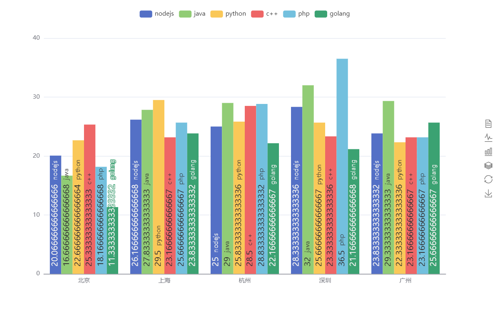

# noedjs-puppeteer

基于nodejs+puppeteer开发的网络爬虫功能，本项目以boss直聘为爬虫对象，爬取前4页的nodejs职位的薪资、地区、具体岗位，把爬取的数据存储起来，然后渲染到页面上

使用说明：本项目是本人学习的内容，并没有任何的商业价值，仅供学习参考

+ `step1`克隆拉取项目
+ `step2`输入下面命令安装依赖包

```shell
npm install --save
npm install --save puppeteer  
//配置文件的依赖项中没有puppeteer包，需要另行安装
```

+ `step3`输入下面命令运行项目

```shell
node app.js
```

+ `step4`在浏览器中输入`127.0.0.1:3000`

+ `step5`在浏览器中输入`127.0.0.1:3000/echarts`访问数据可视化页面

文件说明
+ `middleware`文件中封装了几个用到的方法
+ `router`文件处理路由请求
+ `public`文件存放静态资源
+ `views`存放视图文件
+ `liepin.js`是爬取内容的，需要单独运行此文件 `node linpin.js`
+ `liepin.json`和`data.json`存储爬取的数据
+ `app.js`此文件是入口文件，文件中提供了两种分析获取页面的方法，第一种方法很简便但是得到的数据不是我想要的格式，所以我习惯用第二种方法获取到的数据，以便于我可以把数据展示在页面上。

最后，如果有幸看到此文件，请在议题中帮忙介绍关于数据处理方面的教程(最好是免费的，可以白嫖的)，就是各种各样的数据格式渲染到前端，对于数据分析处理、接口数据接入等方面内容，不胜感激！！！
前方道阻且长，顶峰相见！！


